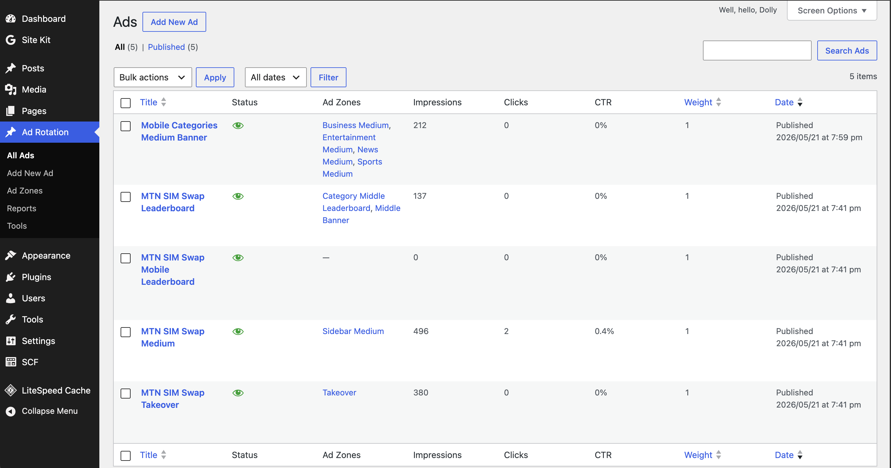
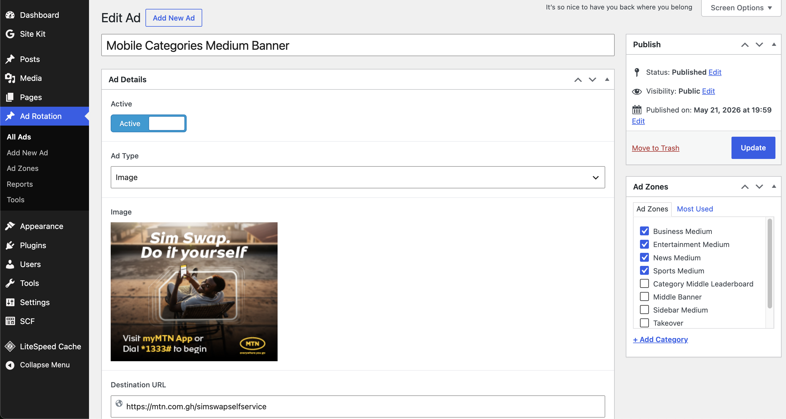
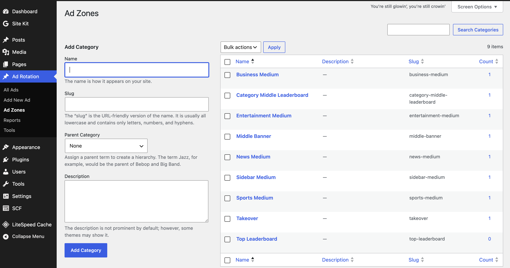
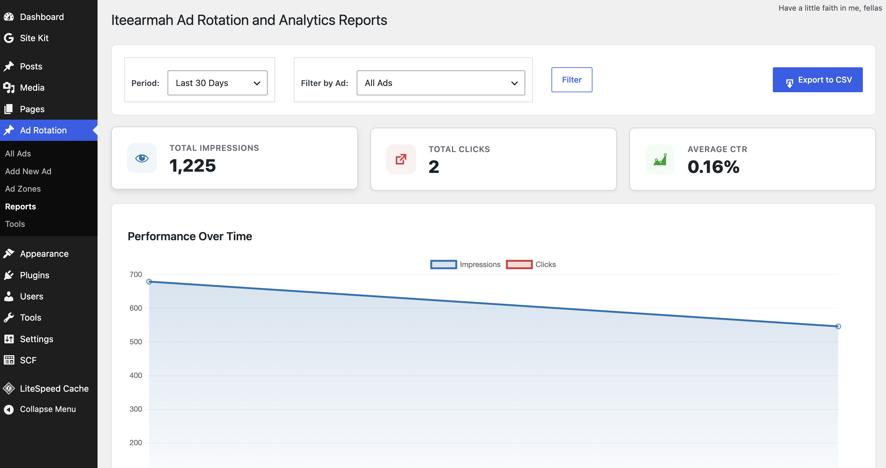
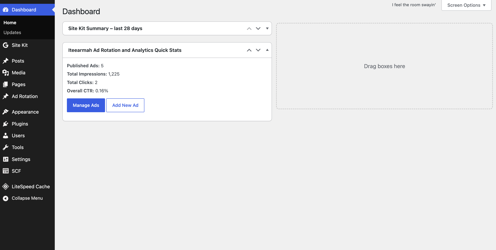

# Iteearmah Ad Rotation and Analytics

[](https://wordpress.org/)
[](https://www.php.net/)
[](https://www.gnu.org/licenses/gpl-2.0.html)
[](https://wordpress.org/plugins/secure-custom-fields/)

**Iteearmah Ad Rotation and Analytics** is a powerful, lightweight, and modern advertisement management system designed specifically for WordPress. Whether you are running a high-traffic blog, a news portal, or a niche directory, this plugin empowers you to manage, rotate, target, and serve ads effortlessly, while tracking every single impression and click in real-time.

---

## ✨ Key Features

- 🎯 **Smart Ad Targeting & Delivery**
  - **Weighted Rotation:** Assign priorities to ads inside a zone to control their delivery frequency.
  - **Geo-Targeting:** Include or exclude ads based on the visitor’s country code (utilizes server-provided headers like `HTTP_X_COUNTRY_CODE` or Cloudflare headers).
  - **Device Targeting:** Optimise delivery by targeting specific devices (Mobile, Tablet, Desktop).
  - **Ad Zones & Advertizers:** Seamlessly group advertisements into placement-specific zones (e.g., Sidebar, Header, Footer) or categorize them by Advertizer.

- 📊 **Performance & Analytics**
  - **Advanced Statistics & Reports:** Interactive local dashboards featuring charts (powered by Chart.js) showing 7-day trends, impressions, clicks, and CTR.
  - **CSV Export:** Export your performance metrics easily for clients or external analysis.
  - **Dashboard Widget:** Access quick-glance insights directly from the main WordPress dashboard.

- ⚙️ **Robust Campaign Control**
  - **Scheduling:** Define precise start and end dates/times for time-sensitive campaigns.
  - **Performance Capping:** Limit maximum impressions or clicks per advertisement to control budget and reach.
  - **Status Toggle:** Instantly activate or pause advertisements with a single click.
  - **Ad Duplication:** Clone existing advertisements in one click to speed up new campaign setups.

- 🔒 **Security & Optimization**
  - **AJAX-Based Serving:** Non-blocking, asynchronous ad serving prevents page-speed delays and circumvents aggressive caching.
  - **User Access Control:** Fine-grained role permissions determine who can create, edit, or view reports.
  - **WordPress Best Practices:** Secure database storage via custom high-performance tables, input sanitization, output escaping, and strict capability checks.

---

## 🔌 Requirements & Dependencies

To ensure maximum performance and native integration, this plugin relies on:
* **WordPress Version:** 5.0 or higher (Tested up to 7.0)
* **PHP Version:** 7.4 or higher
* **Required Dependency:** [Secure Custom Fields](https://wordpress.org/plugins/secure-custom-fields/) (formerly ACF) must be installed and active. The plugin will gracefully display an admin notification if this is missing.

---

## 🚀 Quick Start & Installation

1. **Upload:** Download and upload the `iteearmah-ad-rotation-analytics` folder to your `/wp-content/plugins/` directory (or upload the zip directly via the WordPress Admin Panel).
2. **Activate:** Navigate to **Plugins > Installed Plugins** and activate **Iteearmah Ad Rotation and Analytics**.
3. **Install SCF:** Ensure [Secure Custom Fields](https://wordpress.org/plugins/secure-custom-fields/) is installed and active.
4. **Configure:** Access the new **Iteearmah Ad Rotation and Analytics** menu option in your WordPress Admin Sidebar to begin creating ad zones and campaigns.

---

## 🛠️ Usage & Integration

### Method 1: WordPress Shortcode
Place advertisements anywhere in your post content, pages, or widgets using our lightweight shortcode. Replace `your-zone-slug` with the unique slug of your ad zone:

```wordpress
[itea_adserver zone="your-zone-slug"]
```

### Method 2: Remote / External Placement
Do you want to serve advertisements on an external HTML site or partner network? You can fetch and render your ads remotely using our asynchronous script integration:

```html
<script src="https://your-site.com/?itea_ad_serve=1&zone=sidebar&uid=itea-ad-sidebar" async></script>
```
*Note: Make sure to replace `https://your-site.com/` with your WordPress site URL and `sidebar` with your zone's slug.*

---

## 💼 Management Console & Settings

The plugin provides a intuitive, user-friendly interface for admins and contributors alike:

- **Ad Zones Editor:** Create placement areas and easily acquire the target shortcode or external integration script.
- **Campaign Settings:** Fine-tune permissions, backup/restore all configurations via a simple JSON export/import tool, and clear cache selectively to force immediate ad rotations.
- **Reporting Dashboard:** View interactive performance graphics, CTR statistics, and download custom logs via CSV.

---

## 📸 Screenshots

### 📊 Admin & Analytics Preview

| 📋 Ad Management List | ⚙️ Ad Editor & Targeting |
|---|---|
|  |  |

| 🗺️ Ad Zones Management | 📈 Analytics Reporting Dashboard |
|---|---|
|  |  |

### 🏠 Dashboard Widget


---

## 🔄 Changelog

### v2.2.2
* **UI:** Removed "Integration Codes" column from the advertisements list table for a cleaner interface.

### v2.2.1
* **Maintenance:** Renamed all ACF (Advanced Custom Fields) integration references to SCF (Secure Custom Fields) for better alignment with the required dependency.
* **Compatibility:** Added support for native SCF function names (`scf_`) while maintaining backward compatibility with `acf_` functions.
* **UI:** Updated admin notices and labels to reflect Secure Custom Fields branding.

### v2.2.0
* **Feature:** Implemented "Advertizers" feature to categorize ads by advertiser.
* **Feature:** Added custom fields (Email, Website, Notes) for Advertizers.
* **UI:** Added "View Ads" quick link in Advertizers list.
* **Reporting:** Added ability to filter analytics reports by Advertizer.

### v2.1.0
* **Feature:** Added "Integration Codes" modal to easily copy PHP shortcodes and JavaScript tags.
* **UI:** Added "Integration Codes" column with a quick-view icon to Ads and Ad Zones list tables.
* **UI:** Improved ad and zone edit screens with direct display of integration codes.
* **Improvement:** Unified shortcode and script tag generation logic.
* **Maintenance:** Bumped version to 2.1.0.

### v2.0.0
* **Compliance:** Updated plugin to adhere to WordPress.org detailed guidelines.
* **Compatibility:** Updated "Tested up to" metadata to WordPress 7.0.
* **Security:** Hardened admin notice visibility logic and refined ad export safety.
* **Device Detection:** Improved reliability by integrating `wp_is_mobile()` as a baseline.
* **Maintenance:** Bumped version to 2.0.0.

### v1.9.2
* Maintenance: Created `.gitattributes` file for better archive management.
* Maintenance: Bumped version to 1.9.2.

### v1.9.1
* Maintenance: Updated `.distignore` to include `.idea` directory.
* Maintenance: Bumped version to 1.9.1.

### v1.9.0
* Security hardening: Improved nonce verification across several admin and tracking functions.
* Security hardening: Enhanced input sanitization for role capabilities and file uploads.
* Code Quality: Resolved multiple WordPress Coding Standards (WPCS) warnings and PHPCS violations.
* Code Quality: Improved SQL query safety by ensuring proper placement of PHPCS annotations for dynamic table names.
* Maintenance: Cleaned up project structure by removing unnecessary configuration files.

### v1.8.3
* Added safety checks for `get_field()` and `acf_add_local_field_group()` to prevent crashes when Secure Custom Fields is not active.
* Refined cache clearing logic to target only the plugin's custom post type.
* Improved performance in the reporting dashboard by limiting ad filtering to the 100 most recent ads.
* Standardized asset versioning to use the plugin's version constant.
* Hardened dependency checks to support both 'Secure Custom Fields' and standard 'ACF' naming conventions.
* Updated bundled Chart.js to the latest stable branch and refactored reports rendering to use WordPress enqueue APIs (`wp_register_script()`, `wp_enqueue_script()`, `wp_add_inline_script()`).
* Replaced direct shortcode `<script>` injection with WordPress-enqueued frontend script loading.

### v1.7.2
* Removed external dependency on Chart.js CDN.
* Included Chart.js locally in the plugin to comply with WordPress.org guidelines.

### v1.7.1
* Renamed plugin to "Iteearmah Ad Rotation and Analytics" and updated slug/text-domain to `iteearmah-ad-rotation-analytics`.

### v1.7.0
* Replaced hidden `.gitkeep` with `index.php` in the languages directory to maintain WordPress.org folder compliance.

### v1.6.0
* Finalized text domain migration to `adserver` across all files.
* Verified WordPress.org automated scan fixes and bumped version.

### v1.5.0
* Fixed automated plugin scan issues: added `sanitize_callback` to `register_setting()` calls.
* Updated "Tested up to" to WordPress 7.0.
* Created languages directory for Domain Path compliance.

---

## 📄 License

This plugin is licensed under the GPLv2 or later. See the [LICENSE](LICENSE) file for details.
